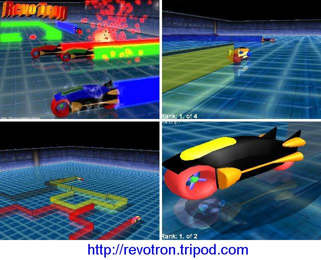



## \[\*a 3d racing game with commercial quality graphics\*\]

### Description

This is a completly 3d racing game with commercial quality!!! It includes a 3d engine with support for advanced techniques like realtime shadows and reflections. You never thought this would be possible in VB. NOTICE: DirectX 8 or higher must be installed on your system. Now about the game itself: it's a Tron clone. The basic game idea of any Tron lightcycle game is that you drive a fast futuristic bike, called lightcycle. It leaves a wall where it goes, so the arena turns into a labyrinth after some time. The goal is to force the enemies to hit a wall while you should try to avoid this for yourself, of course. The last player alive is the winner. REVO TRON also invented a new game mode: the action mode. If it's switched on, you can use speedups, different weapons and shields. You'll get an item after some time which is displayed at the top-right corner of your screen. You can use this item then by pressing the space key. The action mode makes a Tron game become a real action battle! YOU CAN DOWNLOAD THE COMPILED EXE VERSION AT http://revotron.tripod.com
 
### More Info
 

             |
---                |---
**Submitted On**   |2005-02-19 15:25:54
**By**             |[Mathias Kunter](https://github.com/Planet-Source-Code/PSCIndex/blob/master/ByAuthor/mathias-kunter.md)
**Level**          |Advanced
**User Rating**    |5.0 (500 globes from 101 users)
**Compatibility**  |VB 6\.0
**Category**       |[Games](https://github.com/Planet-Source-Code/PSCIndex/blob/master/ByCategory/games__1-38.md)
**World**          |[Visual Basic](https://github.com/Planet-Source-Code/PSCIndex/blob/master/ByWorld/visual-basic.md)
**Archive File**   |[\[\_a\_3d\_rac1854832192005\.zip](https://github.com/Planet-Source-Code/mathias-kunter-a-3d-racing-game-with-commercial-quality-graphics__1-59005/archive/master.zip)

